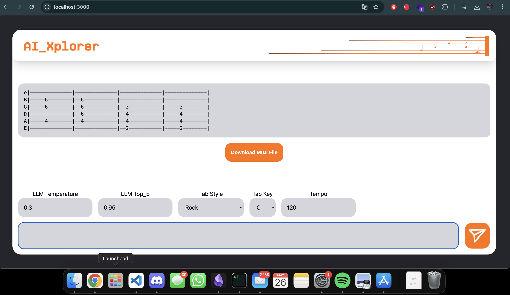

# Repo of the AI_Xplorer team for the Mistral Hackathlon

## Project overview

We purpose a fine-tuned LLM for generating guitar TABs in ASCII format with specific styles.

[What is a guitar TAB](https://youtu.be/pQC3JsbgaTw?si=euwlcUedFJwMBTJq)

## Files 

`mistral-finetuning.ipynb` Notebook for finetuning mistral

`GuitarSet` Open source dataset with guitar recordings, we preprocessed it to have ASCII guitar tabs
    *Q. Xi, R. Bittner, J. Pauwels, X. Ye, and J. P. Bello, "​Guitarset: A Dataset for Guitar Transcription", in 19th International Society for Music Information Retrieval Conference, Paris, France, Sept. 2018.*

`app` Web app for inference

